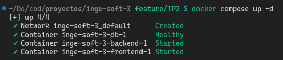
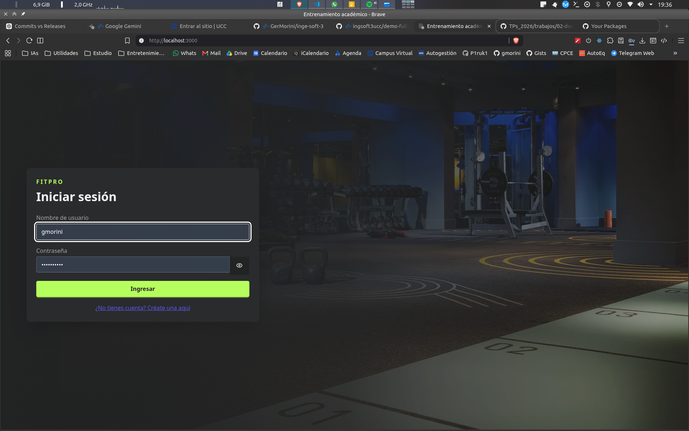
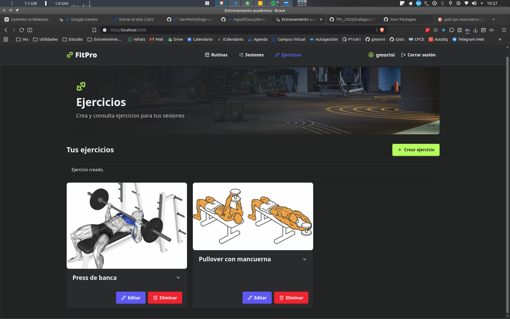
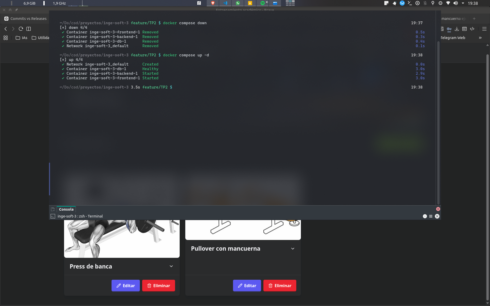
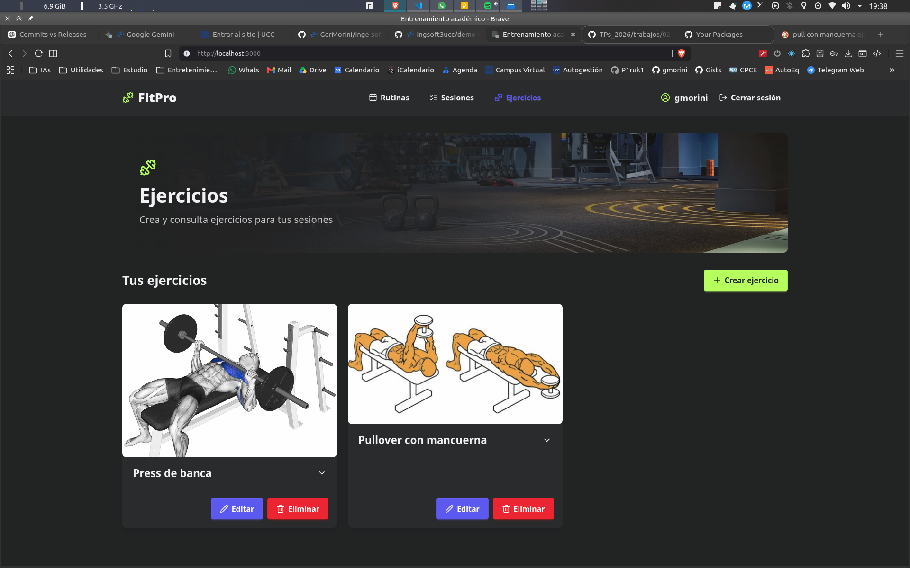
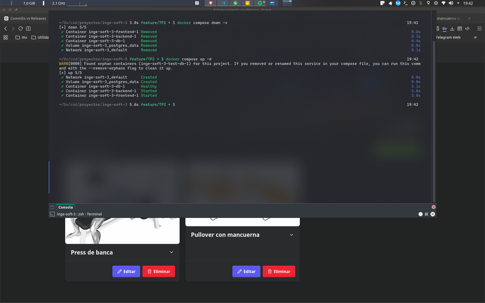
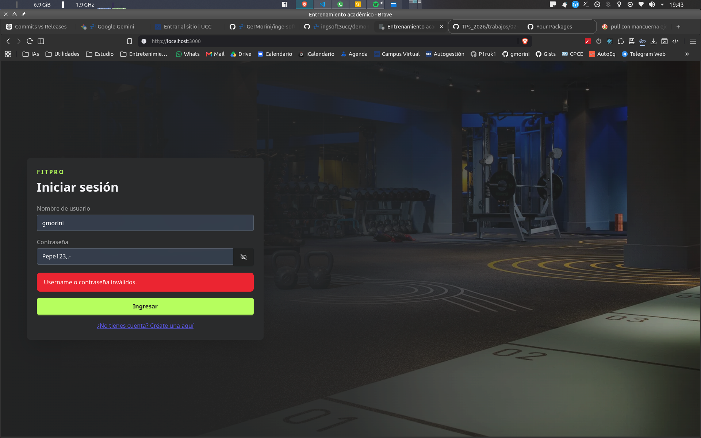
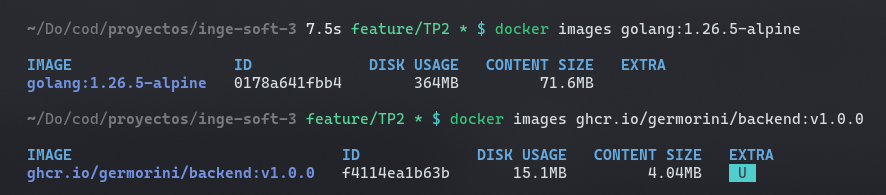
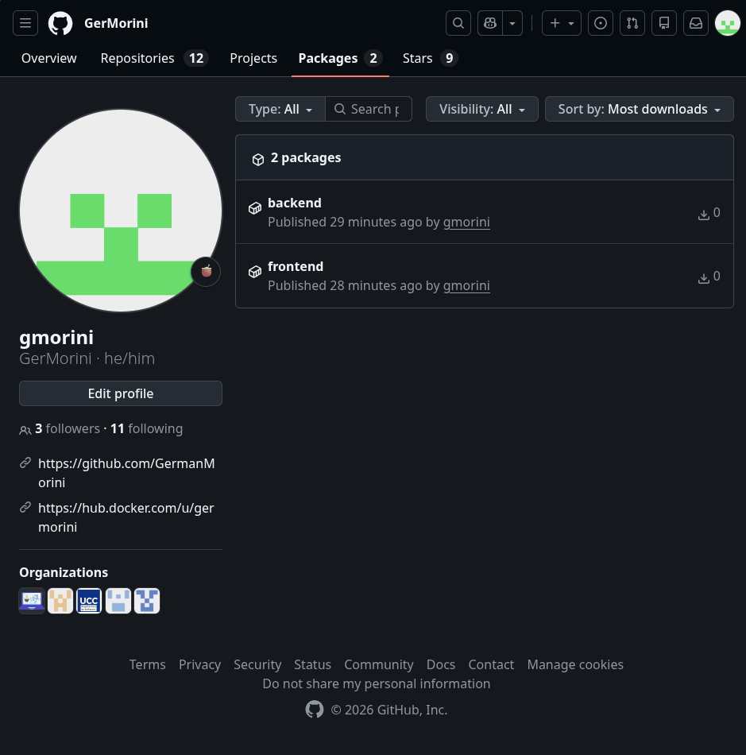

# Evidencias

## TP2 — Contenedores

Repositorio: <https://github.com/GerMorini/inge-soft-3>

Las capturas se encuentran versionadas en el directorio `img` del repositorio.

## Arranque completo desde cero

**Archivo:** `evidencia1.png`



La salida de `docker compose up -d` muestra:

- creación de la red del proyecto;
- PostgreSQL en estado `Healthy`;
- backend iniciado;
- frontend iniciado.

Esto prueba que Compose respeta el healthcheck de la base y levanta el stack completo sin arrancar
manualmente cada componente.

## Funcionamiento end-to-end

### Inicio de sesión

**Archivo:** `evidencia2-1.png`



La SPA se encuentra disponible desde el navegador y presenta el formulario de autenticación servido
por Nginx.

### Datos persistidos desde la interfaz

**Archivo:** `evidencia2-2.png`



La vista autenticada muestra dos ejercicios almacenados: “Press de banca” y “Pullover con
mancuerna”. La información visible proviene de la API y PostgreSQL, por lo que también comprueba el
recorrido navegador → Nginx → backend → base de datos.

## Prueba de persistencia

### Recreación sin eliminar el volumen

**Archivo:** `evidencia2-3.png`



Se ejecutaron, en orden:

```text
docker compose down
docker compose up -d
```

Los contenedores y la red fueron eliminados y creados nuevamente. No se usó `-v`, por lo que el
volumen `postgres_data` permaneció.

**Archivo:** `evidencia2-4.png`



Después del nuevo arranque, la vista continúa mostrando los dos ejercicios. Esto demuestra que los
datos no estaban en la capa efímera del contenedor y que el volumen sobrevivió a la recreación.

### Eliminación explícita del volumen

**Archivo:** `evidencia2-5.png`



Se ejecutaron:

```text
docker compose down -v
docker compose up -d
```

La salida muestra que `inge-soft-3_postgres_data` fue eliminado y creado nuevamente. El aviso sobre
un contenedor huérfano corresponde al antiguo servicio aislado de pruebas y no forma parte del stack
actual de tres servicios.

**Archivo:** `evidencia2-6.png`



Las credenciales válidas antes de ejecutar `down -v` son rechazadas después del nuevo arranque. Esto
confirma que el usuario persistido fue eliminado junto con el volumen y que PostgreSQL comenzó con
una base nueva.

## Comparación de tamaños

**Archivo:** `evidencia3.png`



La captura compara:

| Imagen | Uso en disco mostrado | Contenido mostrado |
|---|---:|---:|
| `golang:1.26.5-alpine` | 364 MB | 71,6 MB |
| `ghcr.io/germorini/backend:v1.0.0` | 15,1 MB | 4,04 MB |

La imagen final ocupa aproximadamente un 96 % menos en disco que la imagen usada para compilar. La
diferencia se debe al build multi-stage: compilador, módulos descargados y herramientas de Go quedan
en la etapa `build`; la etapa `scratch` recibe únicamente el binario estático.

## Imágenes publicadas

**Archivo:** `evidencia4.png`



La captura muestra dos paquetes públicos en GitHub Container Registry:

- `backend`;
- `frontend`.

Ambos son consumidos por `docker-compose.registry.yml` con el tag `v1.0.0`:

```text
ghcr.io/germorini/backend:v1.0.0
ghcr.io/germorini/frontend:v1.0.0
```

Ninguno presenta la etiqueta `Private`

## Resultado

Las evidencias demuestran:

- arranque del stack con Docker Compose;
- comunicación completa entre navegador, frontend, backend y PostgreSQL;
- persistencia al recrear contenedores;
- eliminación de datos al borrar el volumen;
- reducción de tamaño mediante multi-stage build;
- publicación de imágenes versionadas en GHCR.
