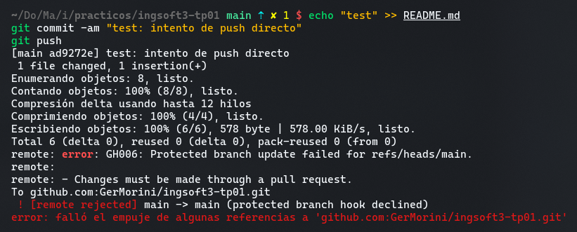
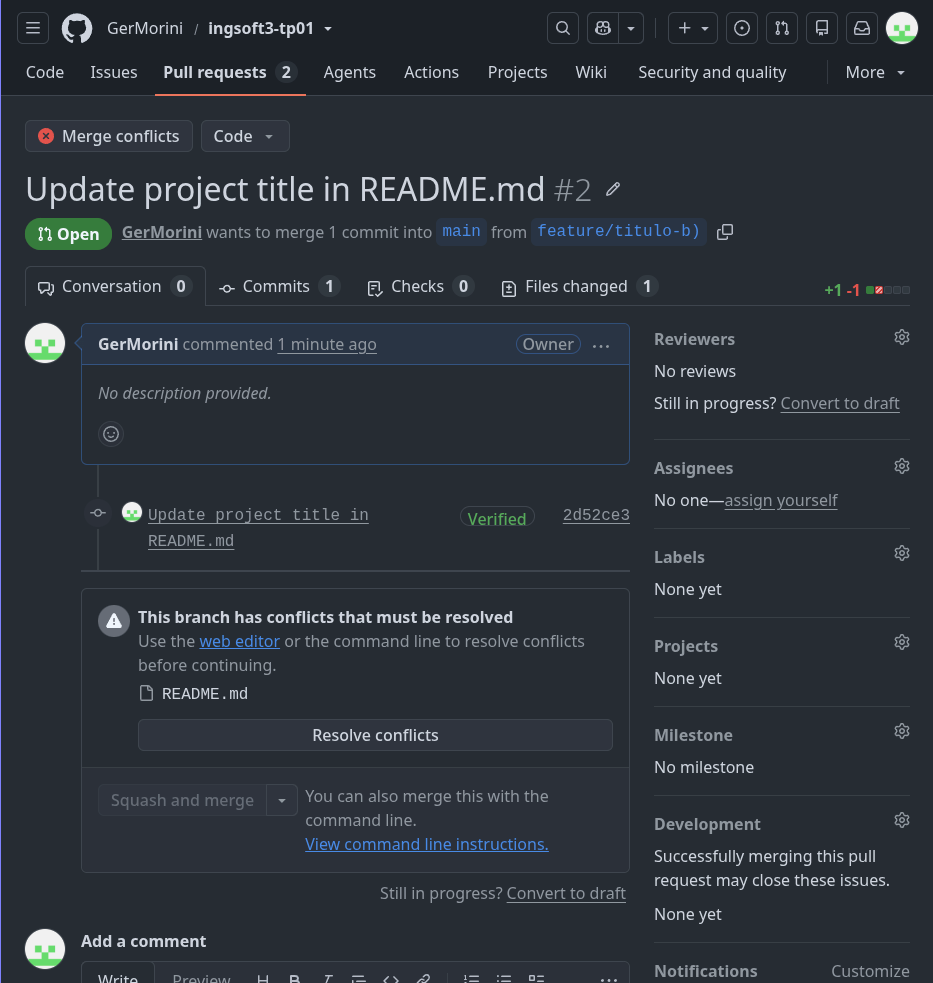
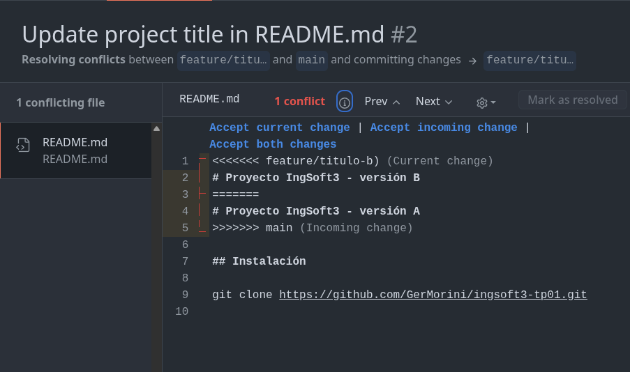
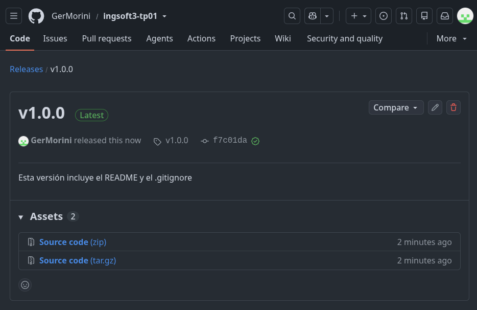

# Evidencias — TP1

## 1. Push directo a main rechazado

GitHub rechazó el push directo porque `main` está protegida y todos los cambios deben ingresar mediante un Pull Request.

## 2. Pull Request bloqueado por un conflicto

El Pull Request de `feature/titulo-b)` no podía integrarse porque su cambio entraba en conflicto con el contenido existente en `main`.

## 3. Marcadores del conflicto

Git mostró las versiones de `feature/titulo-b)` y `main` porque ambas ramas habían modificado la misma línea del título de `README.md`.

## 4. Release publicada

La release `v1.0.0` quedó publicada y asociada al tag correspondiente sobre `main`.